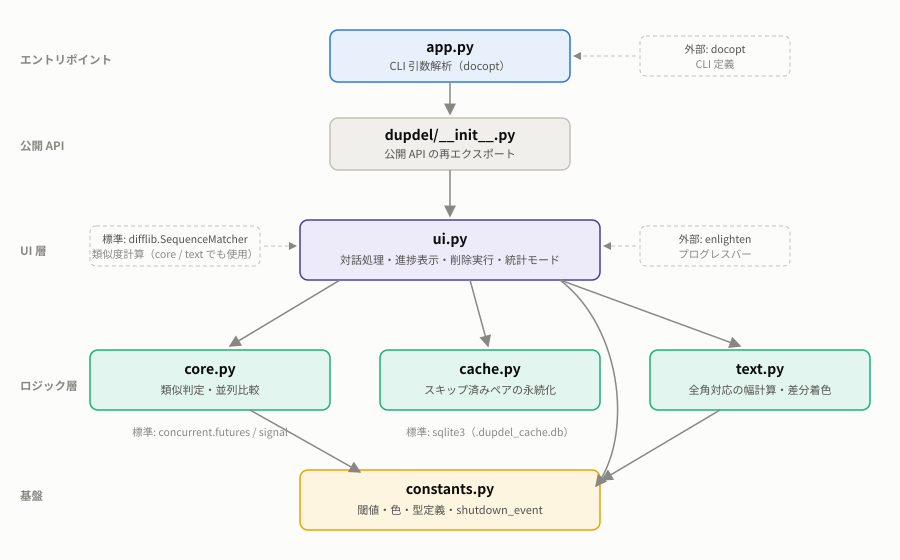
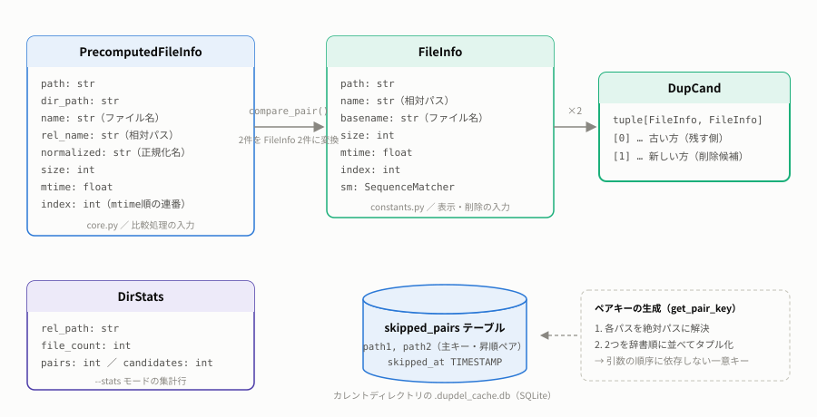
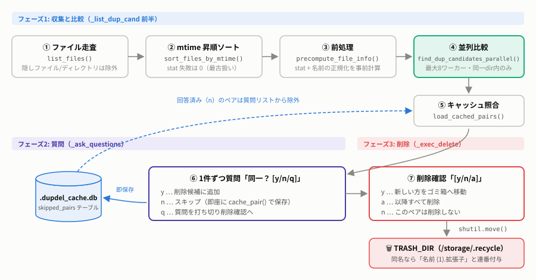
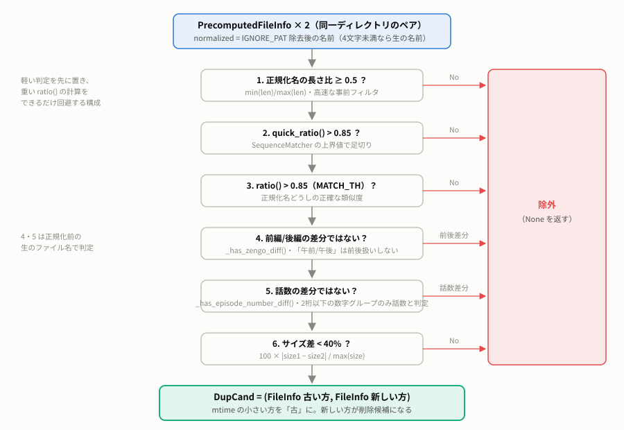
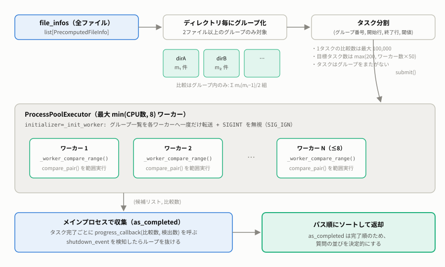
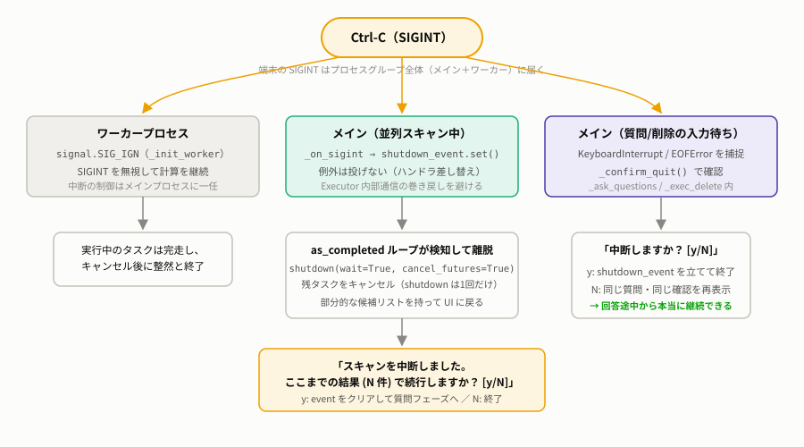
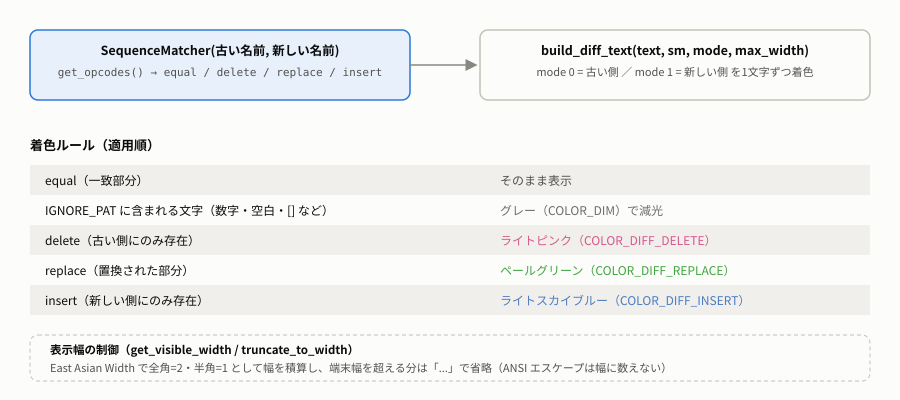

# dupdel アーキテクチャ

dupdel は「同じディレクトリ内にある、名前が似ているファイル」を検出し、対話的にゴミ箱へ移動する CLI ツールです。
このドキュメントは、実際のソースコード（`src/` 以下）の構造と処理の流れを解説します。

## 目次

1. [モジュール構成](#モジュール構成)
2. [データモデル](#データモデル)
3. [対話モードの処理フロー](#対話モードの処理フロー)
4. [類似判定パイプライン](#類似判定パイプライン)
5. [並列比較の仕組み](#並列比較の仕組み)
6. [中断（Ctrl-C）の設計](#中断ctrl-cの設計)
7. [スキップキャッシュ](#スキップキャッシュ)
8. [ファイル名差分の表示](#ファイル名差分の表示)
9. [統計モード](#統計モード)
10. [テスト構成](#テスト構成)

## モジュール構成

| モジュール | 責務 | 主な公開関数・定義 |
|---|---|---|
| `src/app.py` | CLI エントリポイント。docopt で `PATH` と `--stats` を解析 | `main()` |
| `src/dupdel/__init__.py` | パッケージの公開 API を再エクスポート | `run_interactive` / `run_stats_mode` / `find_dup_candidates_parallel` など |
| `src/dupdel/ui.py` | 対話処理・enlighten による進捗表示・削除実行・統計モード | `run_interactive()` / `run_stats_mode()` |
| `src/dupdel/core.py` | ファイル走査・類似判定・並列比較 | `list_files()` / `precompute_file_info()` / `compare_pair()` / `find_dup_candidates_parallel()` |
| `src/dupdel/cache.py` | 「重複ではない」と回答済みのペアを SQLite に永続化 | `init_cache_db()` / `load_cached_pairs()` / `cache_pair()` / `get_pair_key()` |
| `src/dupdel/text.py` | 全角文字対応の表示幅計算と、差分の ANSI 着色 | `get_visible_width()` / `build_diff_text()` / `truncate_to_width()` |
| `src/dupdel/constants.py` | 閾値・ANSI カラー・型定義・グローバル停止フラグ | `MATCH_TH` / `TRASH_DIR` / `FileInfo` / `DupCand` / `shutdown_event` |

依存は上から下への一方向です。`core.py`・`text.py` は `constants.py` にのみ依存し、
`cache.py` は内部モジュールに依存しません（標準ライブラリの `sqlite3` のみ）。
UI とロジックが分離されているため、`core.py` の判定ロジックは enlighten や端末なしでテストできます。

### 主要な定数（`constants.py`）

| 定数 | 値 | 用途 |
|---|---|---|
| `MATCH_TH` | `0.85` | ファイル名類似度の閾値（これ以下は候補にしない） |
| `SIZE_TH` | `200 * 1024 * 1024` (200MB) | サイズ差の**表示上の警告**閾値（超えると赤色表示） |
| `IGNORE_PAT` | `r"[\d_ 　🈑🈞字再前後\[\]]"` | 名前の正規化と差分表示の減光に使う無視パターン |
| `TRASH_DIR` | `"/storage/.recycle"` | 削除ファイルの移動先 |
| `shutdown_event` | `threading.Event` | 全フェーズ共通の停止フラグ |

## データモデル

- **`PrecomputedFileInfo`**（`core.py`）— 比較フェーズの入力。`os.stat` の結果と正規化済み名前を
  事前計算して保持することで、O(N²) 回の比較中にファイルシステムへアクセスしないようにしています。
- **`FileInfo`**（`constants.py`）— 表示・削除フェーズの入力。ペアの差分計算済み
  `difflib.SequenceMatcher` を `sm` として保持します。
- **`DupCand`** = `tuple[FileInfo, FileInfo]` — 重複候補ペア。`[0]` が古い方（残す側）、
  `[1]` が新しい方（削除候補）。順序は `compare_pair()` が mtime 比較で決めます。
- **`DirStats`**（`constants.py`）— `--stats` モードの集計行。
- **`skipped_pairs` テーブル**（`cache.py`）— 「n（重複ではない）」と回答したペアの記録。

## 対話モードの処理フロー

`run_interactive()`（`ui.py`）が全体を制御します。

1. **走査** — `list_files()` が `os.walk` でファイルを列挙。先頭が `.` の
   ファイル・ディレクトリは除外します。
2. **ソート** — `sort_files_by_mtime()` で更新時刻の昇順に並べます
   （stat に失敗したファイルは 0 = 最古扱い）。
3. **前処理** — `precompute_file_info()` が各ファイルの stat と名前の正規化を行い、
   `PrecomputedFileInfo` のリストを作ります。
4. **並列比較** — `find_dup_candidates_parallel()` が重複候補（`DupCand`）を収集します
   （[並列比較の仕組み](#並列比較の仕組み)参照）。
5. **キャッシュ照合** — `load_cached_pairs()` でキャッシュ全件をメモリに読み込み、
   回答済みペアを質問リストから除外します。
6. **質問** — `_ask_questions()` が 1 件ずつ「同一？ [y/n/q]」を尋ねます。
   `y` は削除候補に追加、`n` はその場で `cache_pair()` に保存、`q` で質問を打ち切ります。
7. **削除確認** — `_exec_delete()` が候補ごとに「後者を削除しますか？ [y/n/a]」を尋ね、
   `y`（または `a` 以降の全件）で新しい方を `shutil.move()` で `TRASH_DIR` へ移動します。
   - 移動先に同名ファイルがある場合、`_resolve_trash_path()` が「`名前 (1).拡張子`」の形式で
     連番を付与し、上書きを防ぎます。
   - 移動やゴミ箱ディレクトリ作成の `OSError` は捕捉し、1 件の失敗で処理全体を止めません
     （失敗件数は最後に報告）。

進捗表示は enlighten のステータスバーとカウンター（ファイル一覧・前処理・比較・質問リスト・
削除候補・回答・削除確認）で行います。

## 類似判定パイプライン

`compare_pair()`（`core.py`）は 2 つの `PrecomputedFileInfo` を受け取り、
重複候補なら `DupCand` を、そうでなければ `None` を返します。
軽い判定を先に置き、重い `ratio()` 計算をできるだけ避ける多段フィルタ構成です。

### 名前の正規化（`_normalize_name()`）

比較は `IGNORE_PAT`（数字・空白・`[]`・放送局記号など）を除去した「正規化名」で行います。
ただし正規化後が **4 文字未満** になる名前（例: `20240101.ts` のような日付だけの名前）は、
情報がほぼ消えて無関係なファイル同士が完全一致扱いになるため、生の名前をそのまま使います。

### 前編/後編の判定（`_has_zengo_diff()`）

`SequenceMatcher.get_opcodes()` の `replace` 区間に「前」と「後」が対になって現れる場合、
別内容（前編/後編）とみなして候補から除外します。差分の前後 1 文字を含めて双方が
「午前」「午後」に一致する場合は時刻表現とみなし、除外しません。

### 話数の判定（`_has_episode_number_diff()`）

`replace`・`delete`・`insert` の各差分について、差分位置を含む数字グループ全体に拡張し、
**両側とも 2 桁以下**の場合のみ話数（例: `第1話` と `第2話`、`#11` と `#1`）と判定して除外します。
3 桁以上の数字差分（日付や通し番号）は話数とみなしません。

## 並列比較の仕組み

`find_dup_candidates_parallel()`（`core.py`）は `concurrent.futures.ProcessPoolExecutor` を使います。

- **ディレクトリ単位のグループ化** — 比較は同一ディレクトリ内のみ、というルールに合わせて
  先にグループ化し、2 ファイル以上あるグループだけを対象にします。
  ツリー全体の総当たり走査は行いません。
- **タスク分割** — 各グループを「開始行の範囲」で切り出してタスク化します。
  1 タスクの比較数は最大 100,000、目標タスク数は `max(200, ワーカー数 × 50)` です。
  細かく割ることで進捗更新の頻度と Ctrl-C の応答性を確保しています。
- **データ転送は 1 回だけ** — `initializer=_init_worker` でグループ一覧を各ワーカーへ
  プロセス生成時に一度だけ渡し、タスクごとの転送はインデックスのみにしています。
- **ワーカー数** — `min(CPU コア数, 8)`。
- **収集** — メインプロセスが `as_completed` で結果を受け取り、タスクごとに
  `progress_callback(比較数, 検出数)` を呼びます。完了順は非決定的なため、
  最後に候補をパス順でソートして質問の並びを安定させます。

## 中断（Ctrl-C）の設計

端末の Ctrl-C は**プロセスグループ全体**（メイン＋全ワーカー）に SIGINT を送るため、
場面ごとに扱いを分けています。

| 場面 | 扱い |
|---|---|
| ワーカープロセス | `_init_worker()` で `SIG_IGN` を設定し、SIGINT を無視。中断の制御はメインに一任 |
| メイン（並列スキャン中） | SIGINT ハンドラを一時的に差し替え、`shutdown_event.set()` だけを行う。例外（KeyboardInterrupt）は発生させない |
| メイン（質問・削除確認の入力待ち） | `KeyboardInterrupt` / `EOFError` を捕捉し、`_confirm_quit()` で「中断しますか？ [y/N]」を確認 |

スキャン中に例外を使わないのは、`ProcessPoolExecutor` 内部の通信を例外で巻き戻すと
シャットダウンがデッドロックすることがあるためです。`as_completed` ループが
`shutdown_event` を検知して離脱し、`shutdown(wait=True, cancel_futures=True)` を
**1 回だけ**呼びます（2 回呼ぶと `cancel_futures` フラグが上書きされ、
残タスクが処理され続けてしまうため）。

スキャンが中断された場合は「ここまでの結果 (N 件) で続行しますか？ [y/N]」を提示し、
`y` なら部分的な候補リストで質問フェーズへ進みます。入力待ち中の中断で「継続」を
選んだ場合は、同じ質問・同じ確認を再表示して回答途中から続行できます。

## スキップキャッシュ

「n（重複ではない）」という回答は確定情報として SQLite に永続化し、
次回以降の実行で同じペアを再質問しないようにします（`cache.py`）。

- **保存先** — カレントディレクトリの `.dupdel_cache.db`
- **スキーマ** — `skipped_pairs(path1, path2, skipped_at)`。`(path1, path2)` が主キー
- **キー** — `get_pair_key()` が両パスを絶対パスに解決し、辞書順に並べたタプルを返す。
  引数の順序に依存しない一意キーになる
- **書き込み** — 質問フェーズで `n` と答えた瞬間に `cache_pair()` で 1 件ずつコミット。
  途中で中断してもそれまでの回答は失われない
- **読み込み** — 実行開始時に `load_cached_pairs()` で全件を `set` に読み込み、
  照合はメモリ上で行う（候補ごとの DB アクセスはしない）

## ファイル名差分の表示

`_print_dup_cand()`（`ui.py`）は候補ペアの類似度・サイズ差・ファイル名を表示します。
ファイル名は `build_diff_text()`（`text.py`）が `SequenceMatcher` の opcodes に基づいて
1 文字ずつ着色します。

表示幅は `get_visible_width()` が East Asian Width（全角 = 2、半角 = 1）で計算し、
ANSI エスケープシーケンスは幅に数えません。端末幅に収まらない部分は `...` で省略されます。

## 統計モード

`run_stats_mode()`（`ui.py`）は `--stats` オプションで起動するデバッグ用モードです。

- 並列処理・キャッシュ・対話は使わず、ディレクトリ毎に `compare_pair()` を直列実行
- ファイル数の多いディレクトリから順に処理し、`ディレクトリ / ファイル数 / 比較ペア / 候補数`
  の表を候補数の降順で出力

## テスト構成

| ファイル | 対象 |
|---|---|
| `tests/test_core.py` | 正規化・前後/話数判定・`compare_pair`・走査・並列比較 |
| `tests/test_ui.py` | 表示・質問ループ・削除実行・中断確認・ゴミ箱の連番付与 |
| `tests/test_cache.py` | キャッシュの保存・照合・一括読み込み |
| `tests/test_text.py` | 表示幅計算・差分着色 |
| `tests/test_app.py` | CLI エントリポイント |
| `tests/test_typecheck.py` | mypy による静的型チェックをテストとして実行 |

UI のテストは enlighten のマネージャーを `unittest.mock.MagicMock` に差し替え、
入力は `_blinking_input` のパッチで注入します。並列比較のテストは実プロセスプールを使います。
